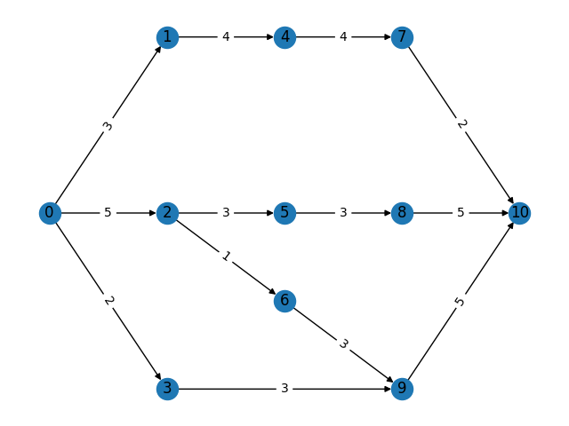
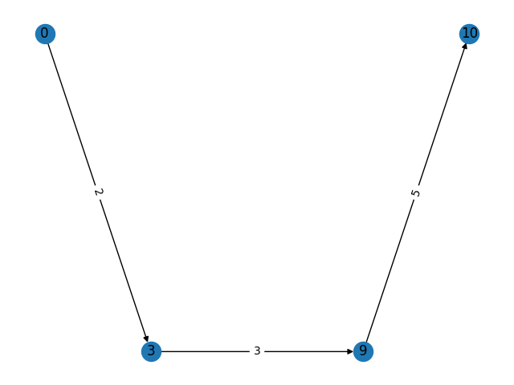
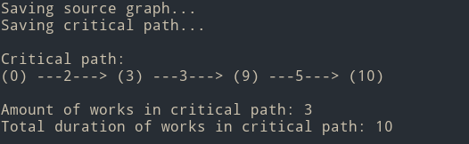

# Лабораторная работа №6 по теории систем и системному анализу

## Построение сетевого графа работ и его анализ методом критического пути (CPM)

# Вариант 1

## Задание

Задан набор работ с множествами непосредственно предшествующих работ (по варианту).
1. Построить сетевой граф, произвести его топологическое упорядочение и нумерацию.
2. Рассчитать и занести в таблицу поздние сроки начала и ранние сроки окончания работ.
3. Рассчитать и занести в таблицу ранние и поздние сроки наступления событий.
4. Рассчитать полный и свободный резервы времени работ.
5. Рассчитать резерв времени событий, определить и выделить на графе критический путь.

|   | a | b | c | d | e | f | g | h | i | j | k |
|---|---|---|---|---|---|---|---|---|---|---|---|
| t | 3 | 5 | 2 | 4 | 3 | 1 | 4 | 3 | 3 | 2 | 5 |

|   | Pa | Pb | Pc | Pd | Pe | Pf | Pg | Ph | Pi | Pj | Pk |
|---|---|---|---|---|---|---|---|---|---|---|---|
| t | ∅ | ∅ | ∅ | a | b | b | d | e | f,c | g | h,i |

## Выполнение лабораторной работы

Исходный код программы приведен в graph_analyser.py Результат работы программы приведен на скриншотe.

